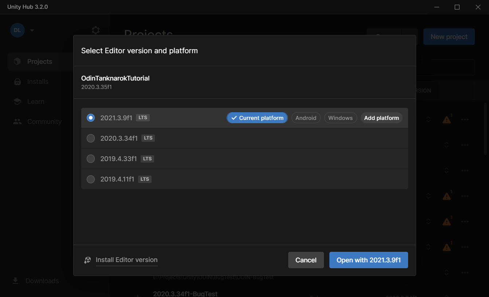
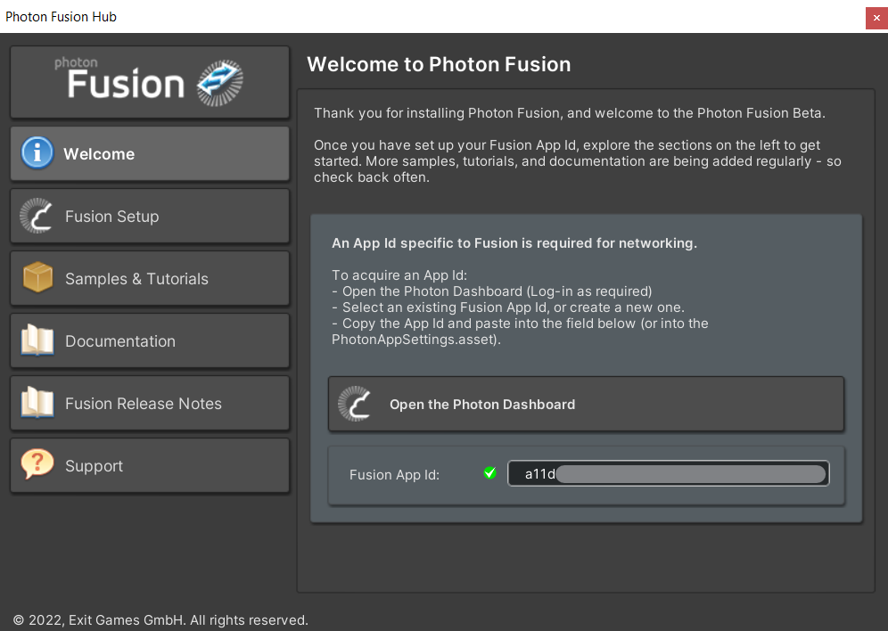
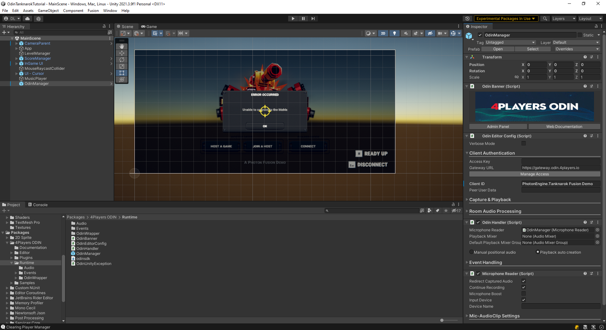
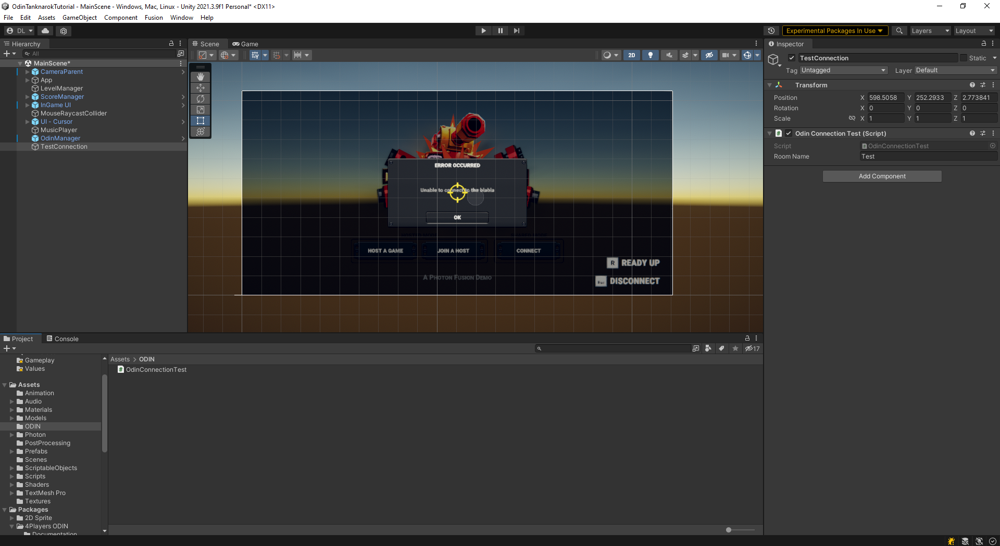
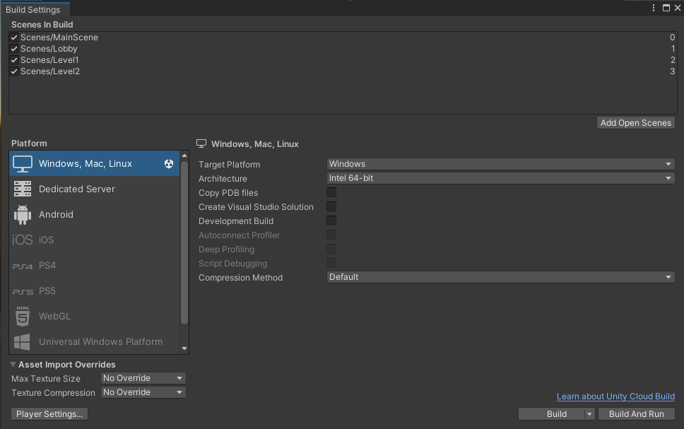
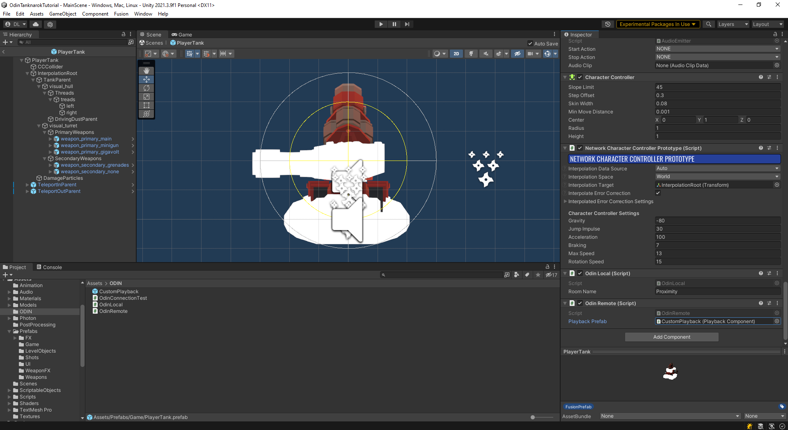
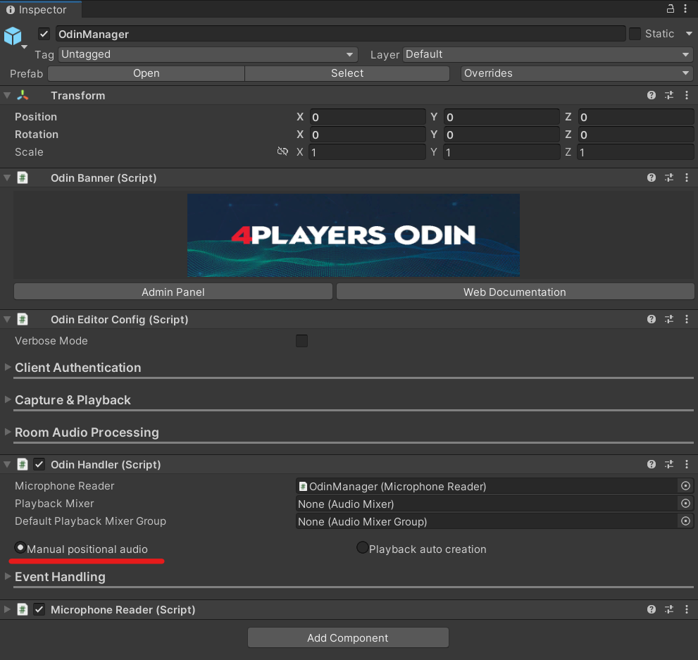

# Integrating ODIN into an existing multiplayer project

In this guide we'll show you how to integrate ODIN into an existing multiplayer project. We'll use the Photon Fusion Tanknarok project as a base multiplayer project without any Voice Chat. In just a few steps you'll learn how to take your project to the next level by integrating ODIN and adding proximity voice chat.

Photon Fusion is a multiplayer framework used in many Unity games. We use it and the Tanknarok Sample Project to give you an idea of how you can integrate ODIN into an existing, fully functional project. The same principles will of course also work for projets developed with Mirror or Unity Netcode. We've even created a guide showing you how to [set up a simple Mirror multiplayer game with ODIN integration](https://www.4players.io/odin/guides/unity/unity-mirror/).

If you're completely new to ODIN and would like to learn more about our features and what makes us special, take a look at our [introduction](https://www.4players.io/odin/introduction/).

## Project Setup

First, we'll download the base project [from the project website](https://doc.photonengine.com/en-us/fusion/current/samples/game-samples/fusion-tanknarok#download). Choose the most up to date version - we've used Version 1.1.1 - download and then unzip the project files. We can then open the project using the Unity Hub. Just select __Open__ and navigate to the folder that contains the project files. 

__Important:__ You need to select the directory that contains the __Assets__, __Packages__ and __ProjectSettings__ directories, otherwise the Unity Hub won't recognize it as a valid project.

Select the Editor version you'd like to use and confirm the __Change Editor version?__ prompt. Please note that ODIN requires Unity version 2019.4 or later, but the Tanknarok project was created in 2020.3.35f1 - so we'll need to use that or any later version. In this guide we used version 2021.3.9f1.



If you see another prompt __Opening Project in Non-Matching Editor Installation__, click the __Continue__ button to convert your project.

After opening up, you'll be greeted by the __Welcome to Photon Fusion__ prompt, asking you to supply your Fusion App Id. This is required for Photon multiplayer to work. Don't worry, Photon allows a small contingent of 20CCU for test projects, so you won't be billed anything during development. Open up the Dashboard and select the __Create a new app__ button. When prompted for a `Photon Type`, select `Fusion`. Finally, copy the App ID of your newly created Application into the field in the Unity Editor and press enter. You should see a small, green check mark, confirming your successful Fusion setup.

If you've accidentally closed the Photon Fusion Hub you can open it up again by selection `Fusion > Fusion Hub` from the Unity Editor menus or press __Alt+F__.



Great - now we've got the base project set up, let's take a look at the interesting stuff: Getting Voice Chat into a game.

## ODIN installation

First, let's install ODIN into our project. ODIN can be imported using either a `.unitypackage` or by using Unity's Package Manager and Git. We recommend the the package manager, because it is easier to keep ODIN up to date. If you don't have Git set up, you can still fall back to the Unity package.

### Package Manager

Select `Window > PackageManager` to open up Unity's package manager. In the top left, select the `+` symbol to add a new package and select __Add package from git URL__. Use the URL 

`https://github.com/4Players/odin-sdk-unity.git` 

and select __Add__. The Package Manager will now download the newest release and resolve any dependencies.

### Unity Package

Download the latest ODIN version as a `.unitypackage` from [https://github.com/4Players/odin-sdk-unity/releases](https://github.com/4Players/odin-sdk-unity/releases). Use the `Assets > Import Package > Custom Package...` option and navigate to the downloaded file. Make sure that all Assets are selected and press __Import__.

## Quick Setup
 
Next, we'll perform the basic setup for ODIN. Let's open the `MainScene` in the directory `Assets > Scenes`. This is the startup scene in which Fusion lets you choose the Network Modes. This scene will also persist in all other scenes - any lobby or gameplay scenes will be loaded in addition to the main scene. 

In this scene we will now add the __OdinManager__ prefab. This prefab contains scripts which handle communication with ODIN servers and allow you to adjust settings. You can find all ODIN files under `Packages > 4Players ODIN` in the Project Window. Navigate to `Packages > 4Players ODIN > Runtime` and drag the __OdinManager__ into the scene. Your Scene should now look something like this:



For ODIN to work, we need an Access Key. Select the __OdinManager__ object in the scene and open the __Client Authentication__ drop-down in the Inspector window. ODIN is free to use for up to 25 concurrent users, without requiring an account. Simply press the __Manage Access__ button, click on __Generate Access Key__ and we're good to go. When you get to a point where the Free Tier isn't enough anymore, [take a look at the Start and Pro Tiers](https://www.4players.io/odin/pricing/#starter).

We'll do a quick test to see if everything was set up correctly. Let's create a new folder `ODIN` in the `Assets` directory and then add the new script `OdinConnectionTest`. This script will contain the following:

```csharp
public class OdinConnectionTest : MonoBehaviour
{
    [SerializeField] private string roomName;
    void Start()
    {
        OdinHandler.Instance.JoinRoom(roomName);    
    }
}
```

We use the `OdinHandler.Instance` singleton to join an ODIN room with the name given by the field `roomName`. The __OdinHandler__ script is the main entry point for interacting with the ODIN Api, persists through scene changes and can be accessed anywhere in your code by using `OdinHandler.Instance`. 

Every client connects to an ODIN server, authenticates with an access token and joins a room. Once the client has joined a room, they are a peer inside the ODIN room. Every peer can add a media stream to that room to transmit their microphone input. Clients can join multiple rooms at the same time and can add multiple media streams at the same time. 

Only clients in the same room can actually hear each other, so you can implement features like a global voice chat for all players and sepearte team voice chats, in which only members of the same team can communicate which each other.

To find more information on the basic ODIN topology, [take a look at the Basic Concepts documentation](https://developers.4players.io/odin/introduction/structure/).

For now, we only want to join a room, so the __OdinConnectionTest__ script is enough for our purposes. Let's create a new empty GameObject in the scene hierarchy and add the __OdinConnectionTest__ component to it. Finally, enter a creative room name (like "Test") and our test setup is complete. Your project should now look something like this:



To test the project, we'll need create a Build and run it in parallel to the editor. This way we can test everything on the same computer. Press `Ctrl+Shift+B` or use the `File > Build Settings...` menu to show the Build Settings window. Make sure that the __MainScene__, __Lobby__, __Level1__ and __Level2__ scenes are shown and selected in the build list. Click on __Build And Run__, select a directory in which your binaries will be created and wait until the Build was started. Switch to the Editor, press play and you should now be able to hear your own voice transmitted via ODIN.



Congratulations, you've officially added Voice Chat to a Multiplayer Game! But right now it doesn't matter where the players are positioned - in fact, we can hear all players in the Start Screen, without having to enter the game. In a real game this would probably become quite chaotic quite fast, so let's improve that and switch to a Proximity Voice Chat.

## Proximity Voice Chat

### Joining and leaving 

First, let's remove the TestConnection object from the MainScene, we won't need it anymore. Instead, we'll use the Player object itself to control when to join or leave a room. Because the Player object is automatically instantiated in the scenes that should allow Voice Chat - i.e. in the lobby and the gameplay levels - it's the perfect fit for us.

You can find the Player prefab in `Assets > Prefabs > Game > PlayerTank`. Let's create a new script called `OdinLocal` and add it to the __PlayerTank__ prefab root. This script will from now on handle joining and leaving the room.

Just as before we'll create a string field to allow us to define the room name and join the ODIN room in `Start()`, but we'll also leave the room in `OnDestroy()`. Now the voice chat will only be active in the lobby and gameplay levels. But because the `PlayerTank` is instantiated for each player in the scene - both the remote and local players - the `JoinRoom` function will be called for each player that enters a lobby. We need a way to differentiate between our local player and the remote clients.

We'll use Fusion's `NetworkObject` for this. This behaviour assigns a network identity to a `GameObject` and allows us to identify players in our game. We get a reference to the `NetworkObject` and store wether the player is local in our new `_isLocal` variable by requesting `networkObject.HasStateAuthority`. This will only be `true` on the local player. Before joining or leaving a room, we add a check for `_isLocal`. Your script should look something like this:

```csharp
using Fusion;
using UnityEngine;

public class OdinLocal : MonoBehaviour
{
    [SerializeField] private string roomName = "Proximity";
    private bool _isLocal;

    private void Start()
    {
        NetworkObject networkObject = GetComponent<NetworkObject>();
        _isLocal = networkObject.HasStateAuthority;
        if(_isLocal)
            OdinHandler.Instance.JoinRoom(roomName);
    }

    private void OnDestroy()
    {
        if(_isLocal)
            OdinHandler.Instance.LeaveRoom(roomName);
    }
}
```

### Playback Prefab

ODIN uses the default `AudioSource` behaviours to play back incoming voice streams. It seemlessly integrates into the Audio system and allows us to adjust all settings just as we're used to from Unity. The connection between these so called __Media Streams__ and the `AudioSource` behaviours is handled by the `PlaybackComponent`. Until now ODIN has automatically created and destroyed the components. But now we need more control over the `AudioSource` settings, especially the 3D sound options, which means we have to handle spawning of these behaviours ourselves.

Let's setup a custom Playback Prefab. Create a new gameobject in your scene hierarchy, call it __CustomPlayback__ and add a `PlaybackComponent` in the Inspector - an `AudioSource` will automatically be added. To change the spatial mode of the audio source from 2D to 3D, set the `Spatial Blend` slider to a value of __1__. We can also adjust the 3D Sound Settings - for the __Tanknarok__ we've chosen a `Min Distance` of __2__ and a `Max Distance` __100__, but you can of course adjust this and any other settings to your preferred values. Finally, convert the object to a prefab and remove the object from the scene.

Next we need to implement a behaviour that handles the spawning of our Playback objects. We create a new script `OdinRemote` and add it to the `PlayerTank` prefab. We set up a reference to our `PlaybackComponent` prefab and - in the Inspector - drag the previously created prefab into the field. Your `PlayerTank` prefab should look like this: 



 Then we start listening to our first Odin event - the `OdinHandler.Instance.OnMediaAdded` event. `OnMediaAdded` gets invoked everytime a new Media Stream is added to an ODIN room our player is connected to. In order for the `PlaybackComponent` to work, it needs a room name, peer id and media id. These three values uniquely identify a Media Stream.

```csharp
using Fusion;
using OdinNative.Odin.Peer;
using OdinNative.Odin.Room;
using OdinNative.Unity.Audio;
using UnityEngine;

public class OdinRemote : MonoBehaviour
{
    // Don't forget to set this value
    [SerializeField] private PlaybackComponent playbackPrefab;
    private PlaybackComponent _spawnedPlayback;

    private void Start()
    {
        OdinHandler.Instance.OnMediaAdded.AddListener(MediaAdded);
    }

    private void MediaAdded(object roomObject, MediaAddedEventArgs eventArgs)
    {
        ulong peerId = eventArgs.PeerId;
        long mediaId = eventArgs.Media.Id;
        
        if (roomObject is Room room)
        {
            NetworkObject networkObject = GetComponent<NetworkObject>();
            bool isLocalPlayer = networkObject.HasStateAuthority;

            if(!isLocalPlayer){
                _spawnedPlayback = Instantiate(playbackPrefab, transform);
                _spawnedPlayback.transform.localPosition = Vector3.zero;
                _spawnedPlayback.RoomName = room.Config.Name;
                _spawnedPlayback.PeerId = peerId;
                _spawnedPlayback.MediaStreamId = mediaId;
            }
            
        }
    }
    
    private void OnDisable()
    {
        if (null != _spawnedPlayback)
            Destroy(_spawnedPlayback.gameObject);
    }
}
```
We retrieve the peer id and the media id from the `MediaAddedEventArgs` and the room name from the `Room` object, after casting. It's important to instantiate the Playback Prefab as a child of the Player object and to reset the local position, to ensure that the `AudioSource` emits sound from the correct position. We also make sure, that we only spawn Playback components for remote players, we don't want to listen to the local player's voice.

Finally, we need disable the automatic playback spawning of the `OdinHandler`. We have to activate the `Manual positional audio` setting on our __OdinManager__ object in the scene.



__Please Note:__ Some implementation choices in the `OdinRemote` script are due to the way the __Tanknarok__ project is set up and to keep the code as short and simple as possible. The sample project does not destroy remote player objects, but instead chooses to reuse them when a remote player rejoins a lobby or game. Therefore we keep track of the spawned playback object and destroy it manually in `OnDisable`.

### Identifying players with custom User Data

If we now test this with two players in a room, everything will seem to work. Other player's voices lower in volume when driving away and we can hear whether a player is on our right or our left. But as soon as a third player enters the room, there's an issue: because `OnMediaAdded` gets called for each remote player, our code will instantiate a Playback prefab for each remote player on all remote player objects. We need some way to connect a Media Stream to a Network Object. 

ODIN's custom User Data feature is ideal for handling this situation. Every peer connected to a room has its own user data, which is synchronized over the ODIN servers. We can define our own Data class and use the `NetworkObject`'s Id to uniquely connect an ODIN peer to an in-game player object. Let's add our User Data implementation: 

```csharp
using OdinNative.Odin;

public class CustomUserData : IUserData
{
    public uint NetworkId;
    
    public override string ToString()
    {
        return JsonUtility.ToJson(this);
    }

    public bool IsEmpty()
    {
        return string.IsNullOrEmpty(this.ToString());
    }

    public byte[] ToBytes()
    {
        return Encoding.UTF8.GetBytes(ToString());
    }
}
```

The `IUserData` interface and `IsEmpty()` and `ToBytes()` implementations are required for ODIN to be able to transmit our custom data. When the data needs to be transmitted, we simply convert the object to a JSON representation using Unity's built-in `JsonUtility.TJson`. For more information on User Data, [take a look at our "Understanding User Data" guide](https://www.4players.io/odin/guides/unity/user-data/).

The important part here is the addition of a `NetworkId` field. We can now create a new `CustomUserData` object in our `Start`method, set the `NetworkId` and supply the user data in our `JoinRoom` call. The new `Start` method in the `OdinLocal` script will now look like this:

```csharp
...
private void Start()
{
    OdinHandler.Instance.OnMediaAdded.AddListener(OnMediaAddedCallback);

    NetworkObject networkObject = GetComponent<NetworkObject>();
    _isLocal = networkObject.HasStateAuthority;
    if (_isLocal)
    {
        CustomUserData roomData = new CustomUserData
        {
            NetworkId = networkObject.Id.Raw
        };
        OdinHandler.Instance.JoinRoom(roomName, roomData);
    }
}
...
```
The `networkObject.Id.Raw` uniquely identifies our local player on the network. ODIN will transfer the custom user data and synchronize it to all peers in the same room. This means, we can now read this value in the `OdinRemote` script. We do this in the `MediaAdded` callback:

```csharp
...
private void MediaAdded(object roomObject, MediaAddedEventArgs eventArgs)
    {
        ulong peerId = eventArgs.PeerId;
        long mediaId = eventArgs.Media.Id;
        if (roomObject is Room room)
        {
            ulong peerId = eventArgs.PeerId;
            long mediaId = eventArgs.Media.Id;
            if (roomObject is Room room)
            {
                Peer peer = room.RemotePeers[peerId];
                CustomUserData userData = JsonUtility.FromJson<CustomUserData>(peer.UserData.ToString());
                NetworkObject networkObject = GetComponent<NetworkObject>();
                bool isLocalPlayer = networkObject.HasStateAuthority;
                if (!isLocalPlayer && userData.NetworkId == networkObject.Id.Raw)
                {
                    _spawnedPlayback = Instantiate(playbackPrefab, transform);
                    _spawnedPlayback.transform.localPosition = Vector3.zero;
                    _spawnedPlayback.RoomName = room.Config.Name;
                    _spawnedPlayback.PeerId = peerId;
                    _spawnedPlayback.MediaStreamId = mediaId;
                }
            }
        }
...
```
We first retrieve the `Peer` object from the rooms `RemotePeers` array with the peer id. The array contains a list of all remote peers connected to the ODIN room. The peer allows us to access the user data as a generic `UserData` object, so we need ot convert it into our `CustomUserData` format, before we can use it. The `JsonUtility` reads the string representation of the generic object and converts it into our custom format. Finally, we get a reference to the `NetworkObject` script and compare the Id to the `NetworkId` stored in the user data object. If it's equal, we know that the newly added Media Stream belongs to the player object.

## What Now?

You're basically done! After building and opening multiple instances of our game, you can now experience the proximity voice chat you've added to the __Tanknarok__ project.

Of course there are a lot of ways we can improve the project. Currently all players will enter the same ODIN room - even if they don't join the same Multiplayer room! We can fix this by combining the name of the multiplayer room with the ODIN room name we've chosen and use the result when joining the room:

```csharp
...
string combinedName = networkObject.Runner.SessionInfo.Name + "_" + roomName;
OdinHandler.Instance.JoinRoom(combinedName, roomData);
...
```

You might also have noticed, that the game's music and sound effects are kind of loud. We can easily fix this, by navigating to `Assets > Audio > Mixer` and adjusting the volume settings of the `Master`, `Music` or `SFX` mixers. You could also create a new Audio Group for the in game voice, link it to the Playback Prefab's `AudioSource` we created and fine tune the voice chat volume. This way you can also easily implement UI controls to allow players to adjust the volume in-game.

There are also issues that go beyond the scope of this tutorial. You might have noticed, that the direction a voice comes from sometimes does not exactly match what you'd expect. Unity's Audio system assumes the listener to always be at the location of the `AudioListener` script. In the __Tanknarok__ sample project, this script is positioned on the `CameraParent` game object, which represents the position the camera should look at. The position of this object does not always match the player location. To improve this, we'd have to add an `AudioListener` script to the local players gameobject and deactivate the existing behaviour (Unity requires you to always have only one active `AudioListener`). If you'd like us to add the solution to this tutorial or have other feedback, [let us know on the discord server](https://discord.gg/9yzdJNUGZS)!